# 压缩折角网格斜激波问题研究
  
## 项目概述
本研究针对特定来流状态下，以下所示几何形状的流动特性进行详细分析：
  
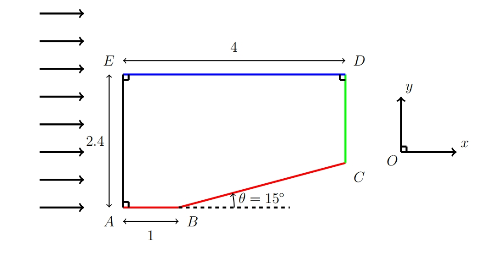
  
### 问题设定
考虑一个半无穷大空间中的均匀来流，其流动方向如上图所示箭头指向。流动的具体状态参数为：

  
  
折角角度为15°
  
  
为了优化您提供的控制方程的视觉体验，我会对方程进行一些格式上的调整，主要是在排版和缩进上。以下是调整后的格式：
  
---
  
### 控制方程简述
  
流体动力学的基本控制方程可以表达为：
  

  
  
  
其中各项可以写作

  
这种格式将使方程组更加清晰和易于阅读，同时保持数学符号的精确性和一致性。
## 网格生成
  
### 方法简介
本研究中采用代数方法生成网格，其代数方程描述如下：

  
  
其中，L 和 H 分别代表计算域的宽度和高度，nx 和 ny 为网格分割数。
  
### 结果展示
本方法可同时生成适用于有限体积法和有限差分法的计算网格。
  
对于有限体积法，通过计算每个网格面的中心位置，形成下图所示的网格结构：
  
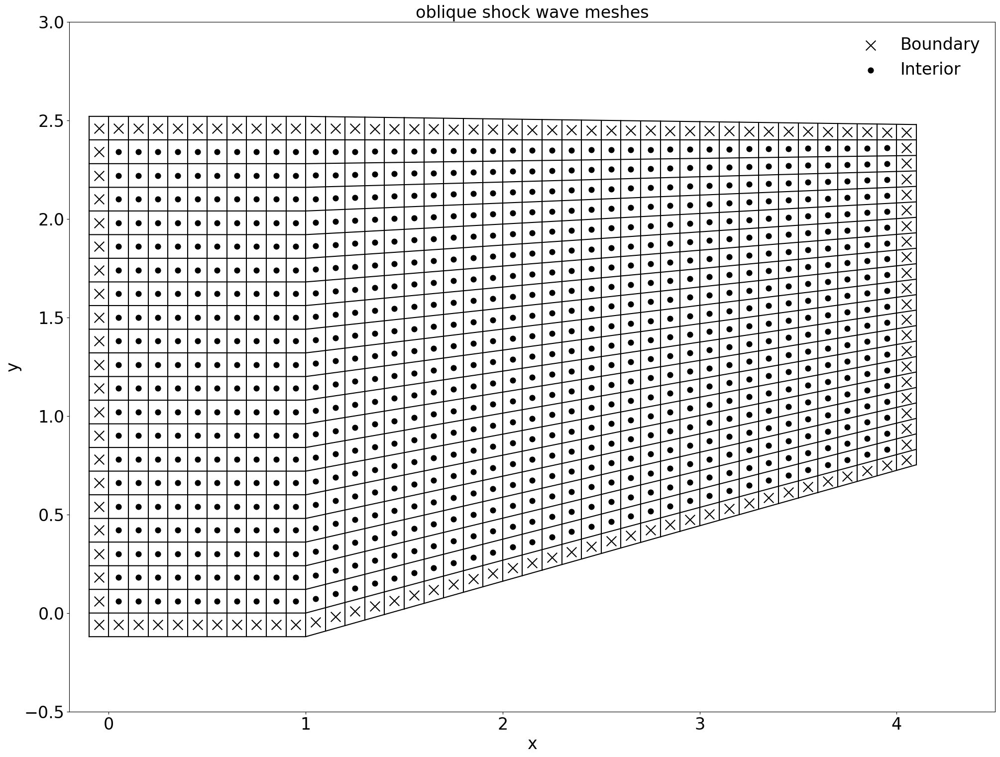
  
为了在有限体积法中计算界面通量，我们在计算域的边缘额外增设一层网格以便作为边界处理：
  
有限差分法则通过坐标变换将物理域映射到计算域，但是需要注意的是，贴体函数的不可微性质可能会为方程变换带来一定的挑战。
  
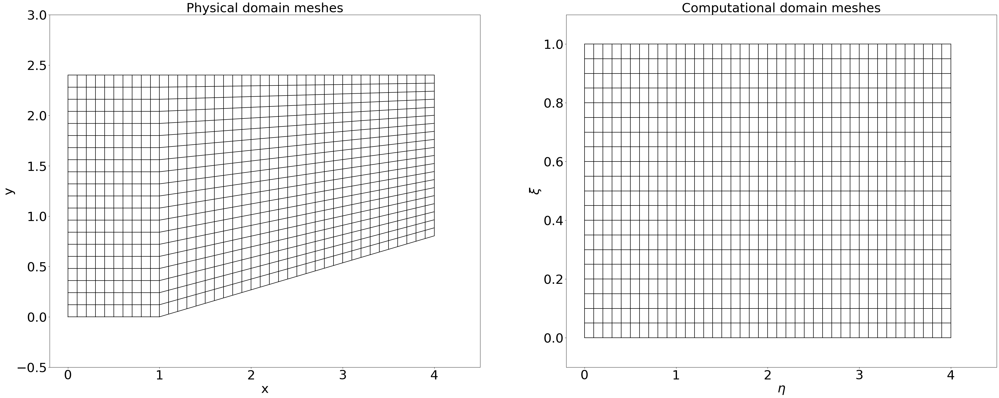
  
考虑到计算的便利性，后续分析将主要基于有限体积法进行。
  
## 边界条件设置
### 边界条件设置的方法概述
  
在计算壁面附近的流体通量时，我们采用了反射边界条件。这种条件适用于壁面，确保流体不穿透壁面。
  
#### 斜边壁面的边界条件处理
对于模型中底部的斜边壁面，我们首先将流体速度的直角坐标系分量转换为斜边坐标系下的分量。斜边坐标系  下的速度分量  可以通过以下变换公式获得：
  

  
  
  
其中， 是斜边与水平方向的夹角， 和  分别是直角坐标系下的速度分量。
  
在斜面坐标系中，我们将  方向定为垂直于壁面的方向。因此，在斜边处，我们将垂直于壁面的速度分量反向处理，以模拟流体的反射行为。这可以表示为：

  
  
  
之后我们通过逆变换将经过反向处理后的速度分量变换回直角坐标系。
  
#### 其他边界的处理
对于模型中的其他边界，我们采用零梯度边界条件。这意味着在边界处流体的属性（如速度、压力）沿边界的法向不发生变化。数学上，这可以表示为：

  
  
这里， 是边界上的流体属性， 和  是靠近边界的内部网格点的对应属性值。
  
## 有限体积法和激波处理
### 有限体积法
有限体积法是一种用于求解偏微分方程的数值方法，尤其在计算流体动力学（CFD）领域中广泛使用。该方法的核心思想是将求解区域划分为一系列控制体积（或单元），并在每个控制体积上应用守恒定律。
  
基本步骤如下：
  
1. **离散化**：将计算域划分成小的、有限的控制体积。
  
2. **积分形式**：对流体动力学的基本方程（如纳维-斯托克斯方程）在每个控制体积上应用，将其转化为积分形式。
  
3. **通量计算**：计算每个控制体积表面的通量（即物质、动量、能量的流动）。
  
4. **求解方程组**：通过适当的数值方法解决控制体积上的积分方程，从而求解每个体积中的未知量（如速度、压力、温度）。
  
5. **迭代与收敛**：采用迭代方法解决整个计算域的方程组，并确保结果的收敛性。
  
有限体积法的优点在于其对守恒定律的直接应用，确保了在数值计算中物理量的守恒，这对流体力学问题尤为重要。同时，它适用于复杂的几何形状和不规则网格。
  
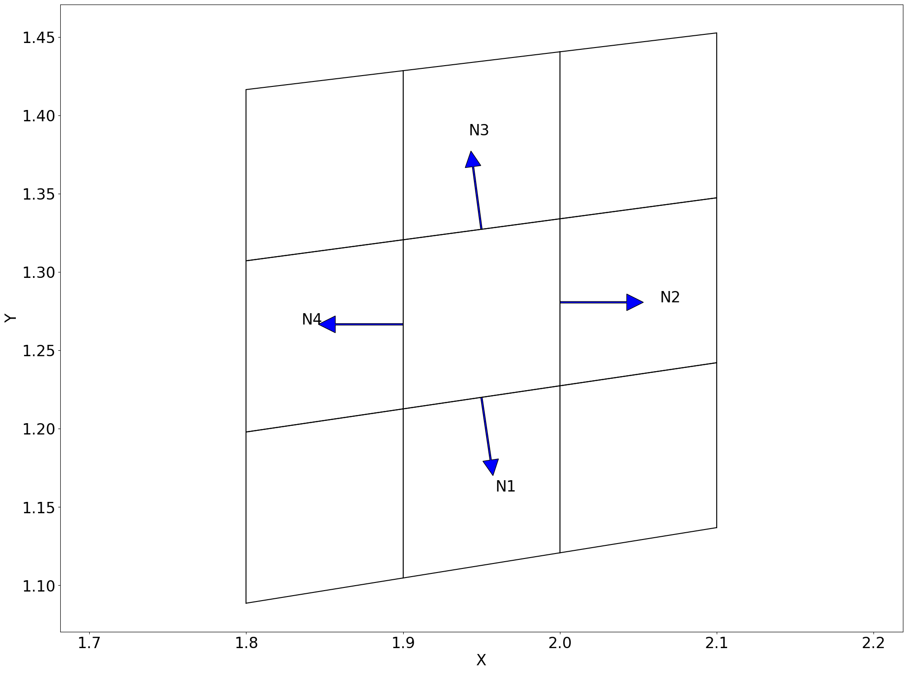
  
### 激波求解
如下关系式描述了折角，马赫数与激波角度的关系：

  
  
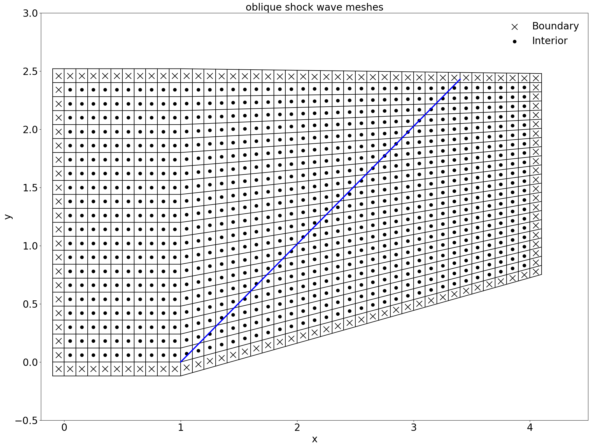
  
通过迭代计算可以快速解出的解析值。
  
如果对于上壁面条件，可以得到：
  
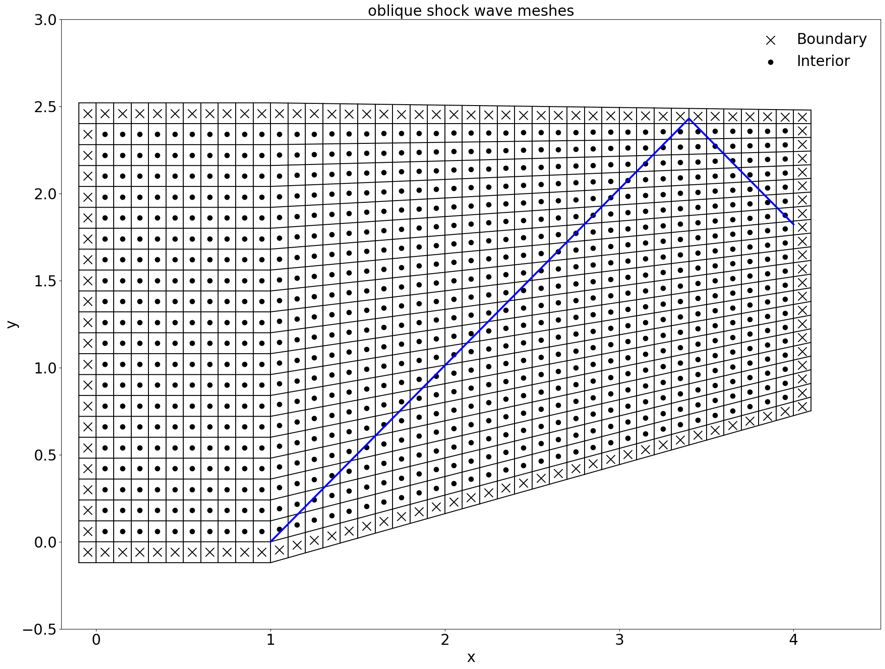
  
## Marcormark格式
### 方法概述
我们采用有限体积法结合MaccorMark算法来处理数值通量，为了程序的稳定，并适当添加人工粘性项来维持数值稳定。
  
### 实现步骤
#### 预测器
预测器方程用于计算单元格在下一个时间步的状态变量 ，其中  是单元格的面积，在三维中对应体积， 是时间步长。状态变量的更新涉及对流项和耗散项的通量向量。
  

  
  
  
其中通量向量  和  以及耗散项  定义如下：
  

  
  
  

  
  
  
耗散项  和  包括压力和人工耗散系数的函数：
  

  
  
  
引入新项  代表正常声速， 是人工耗散系数。F方向上同理。
  
#### 修正器
修正器方程用于校正单元格在下一个时间步的实际状态变量 ，该方程如下所示：
  

  
  
  
 是单元格的面积， 是时间步长。
  
通量向量  和  的扩展包括对流项和耗散项：
  

  
  
  
这里  和  代表不同方向上的距离向量.
### 结果展示
在计算过程中，该格式通过前后格点的数在界面通量处进行重构，在引入人工耗散项后，可以相对长时间保持稳定。
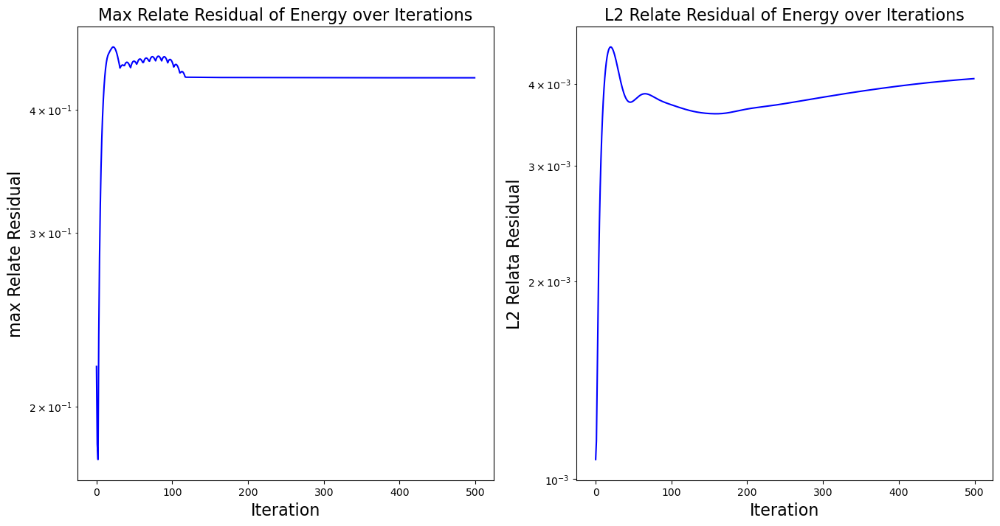
  
对于上壁面的情况，可以得到如下结果：
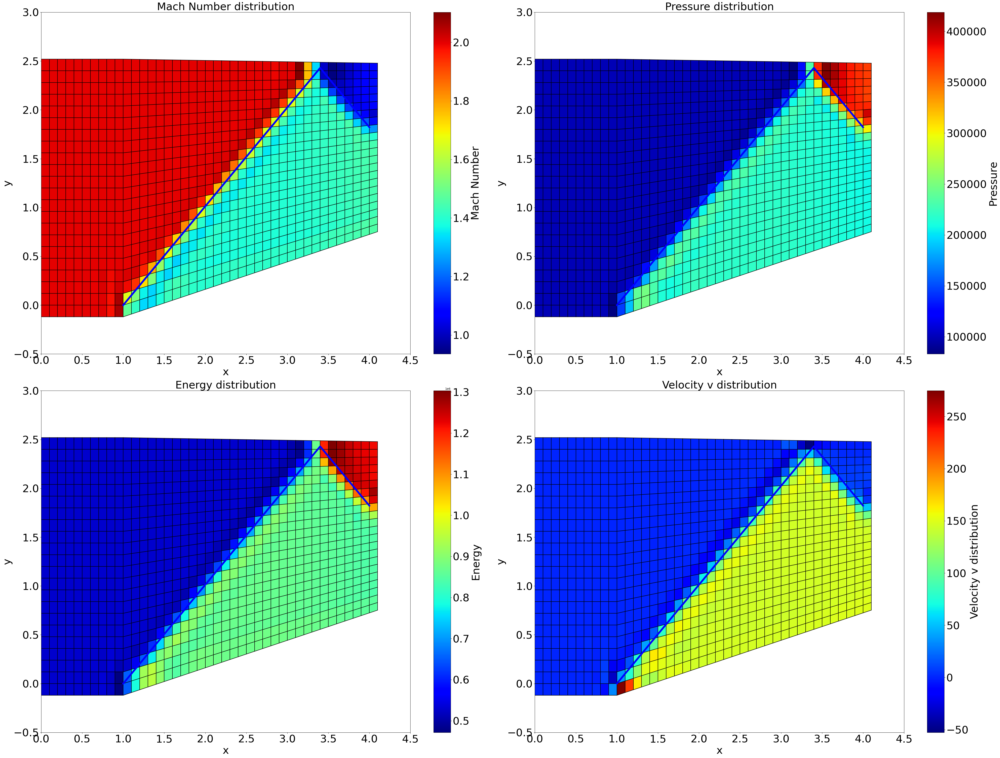
  
对于上出口情况，可以得到如下结果：
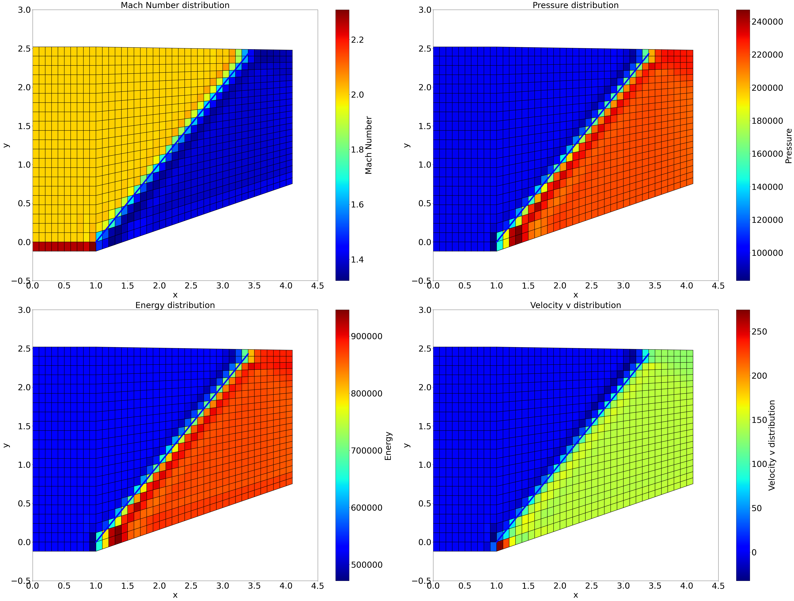
  
在这里插入Marcormark格式的结果图片。
  
## NND+VanLeer格式分解
### 方法概述
除了上述的类似中心格式+人工粘性的数值方法，迎风格式也在CFD中被广泛使用广泛使用，为了在界面处重构出适用于迎风格式的数值通量，我们采用VanLeer+NND格式，VanLeer将通量在每个网格格心处分裂为,NND格式将分裂的数值通量插值到界面。
  
### 实现步骤
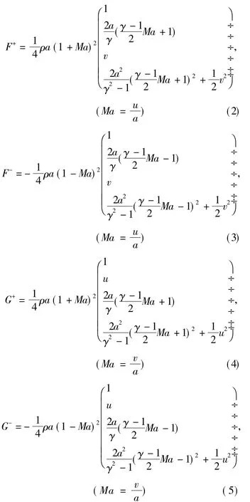
VanLeer本身并不会带来精度误差，但将分裂通量从格心插值到界面时，依然会引入差分格式误差，为了保持相对稳定，我们引入NND格式：
  
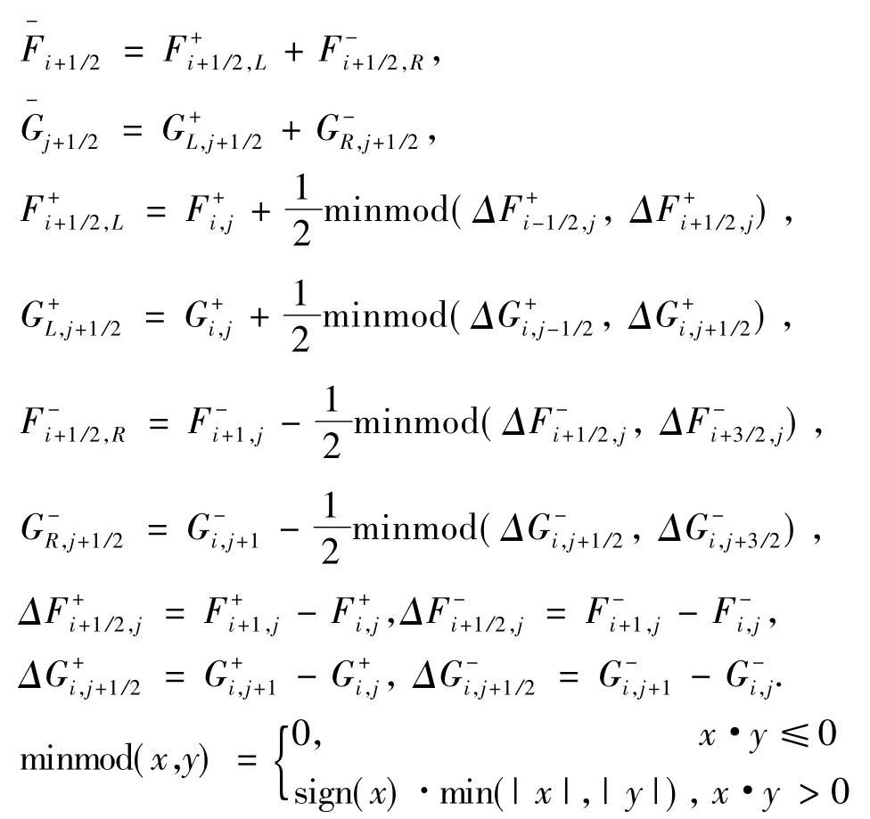
  
NND通过minmod函数控制界面处的通量流动，并总是选取最小的波动方式进行界面通量的重构。
  
### 结果展示
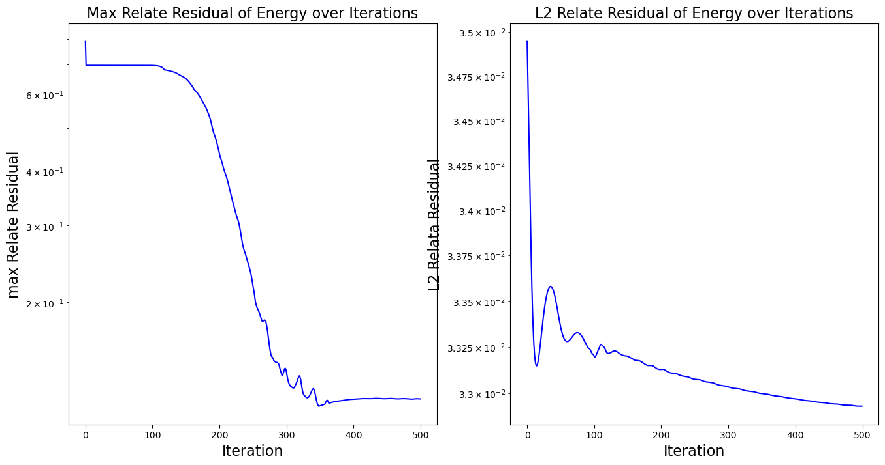
可以看到，相对于Marcormark格式，该方法获得了更好的稳定性，残差快速收敛并保持在量级。
  
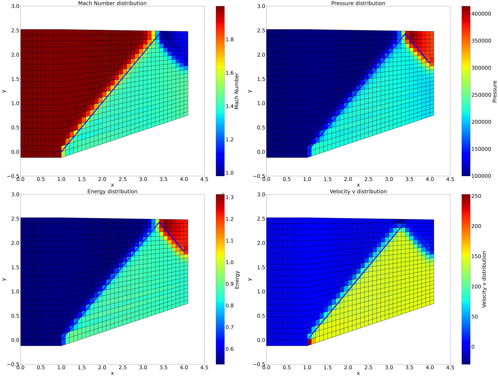
  
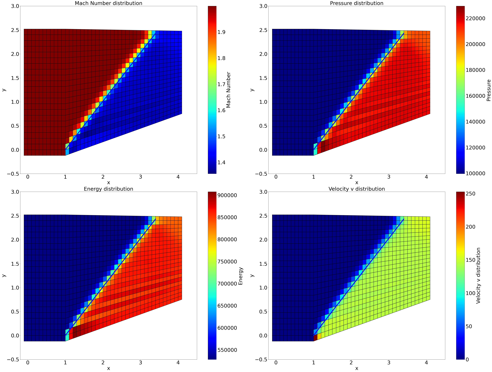
  
## 显示时间推进
### 方法概述
为了保证稳定性，显式时间推进需要考虑时间步长，我们通过如下方法计算Marcormark和NND+VanLeer中用到的dt：

  
  
循环计算得到最小的dt作为更新时间步。
  
  
## 参考文献
基于Van Leer矢通量分裂的计算方法研究与应用 苏克勤，刘 英，曹殿立
计算流体力学 李新亮
计算流讲义 蔡庆东
Finite-volume-solver https://github.com/vasko6d/finite-volume-solver
FluidSimulationTutorialsUnity https://github.com/clatterrr/FluidSimulationTutorialsUnity
  